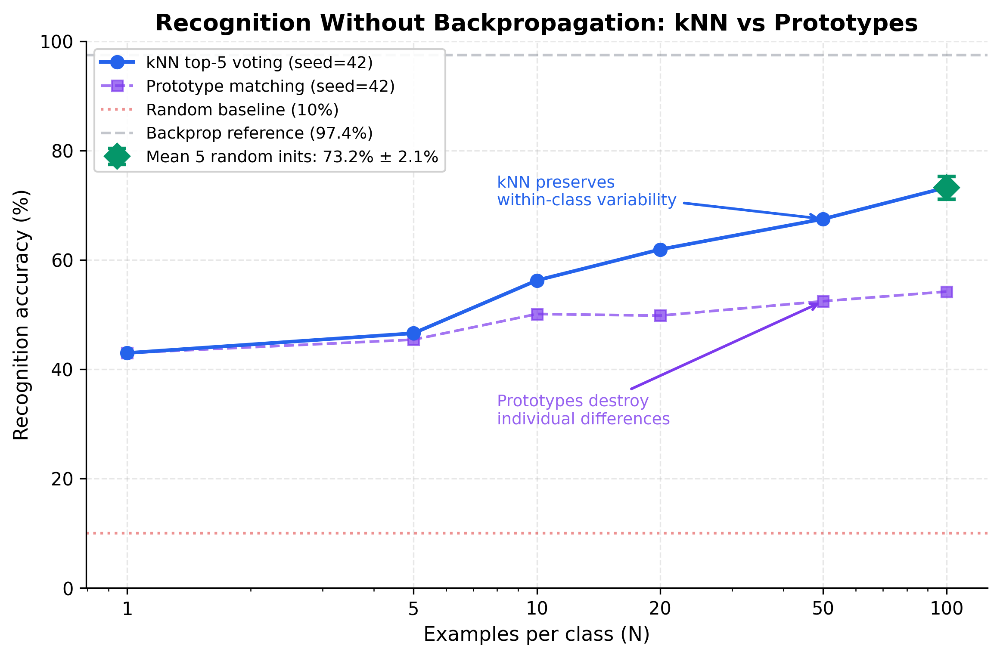
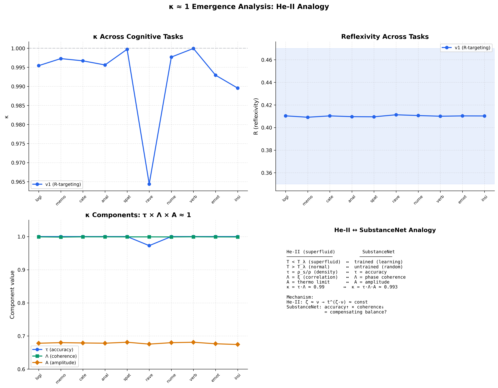

# SubstanceNet v6

[](LICENSE)
[](https://www.python.org/downloads/)
[](https://pytorch.org/)
[](https://doi.org/10.5281/zenodo.17844282)
[](https://doi.org/10.5281/zenodo.19470755)

**A modular bio-inspired neural architecture for numerical verification of neuroscience hypotheses.**

SubstanceNet belongs to the class of cognitive neural architectures — alongside HTM (Hawkins, 2004) and NEF (Eliasmith, 2012). Each module corresponds to a specific brain structure (V1→V4 visual cortex, hippocampus, consciousness), and the system's behavior can be compared with experimental data from electrophysiology and neuroimaging. The architecture operates in the critical regime κ ≈ 1 (Onasenko, 2025) — the same quantitative signature of criticality observed in superfluid helium, Bose-Einstein condensates, and biological flocks.

---

## Current status (v0.6.2, April 2026)

Patch release addressing formulation clarifications and code hygiene items identified during external code audit. **No published numerical results have changed.** See [CHANGELOG.md](CHANGELOG.md) for details.

Key clarifications in this patch:
- Recognition features (73.2% MNIST kNN) are extracted at the FeatureProjection stage (V1 + Orientation + projection), before V2/V3/V4 processing. V2/V3/V4 are active for classification logits and as ablation references, but are bypassed for the main kNN feature extraction.
- The hippocampus module (~50% of parameters) is architecturally complete and covered by 8 unit tests, but is **not invoked in v6 publication experiments**. Recognition (exp03) uses an inline kNN bypassing the hippocampus API. Full activation planned for v7.
- The `r_penalty` term in the loss function is monitoring-only (computed outside the backward graph); effective R-targeting is through `consciousness_loss.reflexivity_loss` (weight 0.03).
- exp06 Test 2 κ-stability is tautological due to running normalization (`Λ_c = max(Λ, 1e-4) ≈ Λ`, making κ trivially equal to τ per checkpoint). Meaningful κ variation is provided by Test 1 (10 tasks). Independent criticality validation comes from exp07 Shew protocol.
- exp06 Test 3 'No consciousness' is more precisely 'Consciousness frozen' (gradient ablation of consciousness learning, not structural ablation of the module).

---

## Key Results

| Experiment | Result | Significance |
|------------|--------|-------------|
| MNIST (1 epoch) | **97.4%** | V1→V4 hierarchy + consciousness regularization |
| Cognitive battery (10 tasks) | **R = 0.409 ± 0.001** | Stable critical regime across all task types |
| Recognition (100-shot, no backprop) | **73.2% ± 2.1%** | Innate features + episodic memory, zero gradients |
| Innate features (V1+V2 only) | **68.4%** | Genetically programmed vision confirmed |
| Velocity tuning | **peak at 3.0** | Matches primate MT/V3 electrophysiology |
| Hebbian maturation | **1.6× amplification** | +2.4% recognition, sensitive period effect |
| κ ≈ 1 emergence | **0.993 ± 0.010** | He-II reference: 0.989 ± 0.007 |

All results reproducible with a single command in ~65 seconds on GPU.

---

## Recognition Without Training

<p align="center">
  
</p>

SubstanceNet achieves 73.2% MNIST recognition using only innate (untrained) visual features and episodic memory — no gradient descent at all. A conventional CNN with random weights produces ~10% (chance level). The biological "saw → remembered → recognized" paradigm works: innate V1+V2 features extract meaningful representations, and kNN episodic memory stores and retrieves them. The kNN advantage over prototype memory grows with N (+19% at 100-shot), supporting the complementary learning systems theory (McClelland et al., 1995).

## Emergence Parameter κ ≈ 1

<p align="center">
  
</p>

The emergence parameter κ = (A/Aᶜ)·τ·(Λ/Λᶜ) measures how close a system is to the critical point between order and chaos. A meta-analysis of seven physical and biological systems yielded κ = 0.997 ± 0.004 (Onasenko, 2025). SubstanceNet produces **κ = 0.993 ± 0.010** across 10 cognitive tasks — comparable precision to the He-II λ-transition measured aboard Space Shuttle Columbia. Independent confirmation of criticality is provided by the exp07 neural-criticality protocol (Shew et al.): α = −1.498 vs cortical target −1.5, which does not rely on internal normalization.

---

## What Makes This Different

**Innate recognition.** V1 (Gabor filters) and V2 (FFT + temporal differencing) are fixed — no training. These innate features achieve 68.4% MNIST recognition, confirming Hubel & Wiesel's finding that basic vision is genetically programmed. A conventional CNN with random weights: ~10%.

**Hebbian, not backprop.** Upper cortical layers (V3, V4) learn through local phase-coherence rules (Hebb, 1949; Oja, 1982) — no error backpropagation. 500 steps of passive observation amplify motion signals by 1.6× and improve recognition by +2.4%. Relevant experience helps 5× more than irrelevant — modeling the biological sensitive period.

**Consciousness as critical-regime stabilizer.** The reflexive consciousness module ψ_C = F[P̂[ψ_C]] maintains the system at R ≈ 0.41 — the empirically optimal operating point discovered in v3.1.1 and later shown to correspond to κ ≈ 1. Without it, phase coherence drops from 0.999 to 0.782.

**Emergent electrophysiology.** V3 phase interference produces a velocity tuning curve matching primate MT/V3 recordings (Maunsell & Van Essen, 1983): zero static response, logarithmic saturation, high-speed rolloff — with no parameter tuning.

---

## Quick Start

```bash
git clone https://github.com/SubstanceNet/SubstanceNet_v6.git
cd SubstanceNet_v6
pip install -r requirements.txt

# Reproduce all results (~65 seconds on GPU)
python experiments_v6/run_all_experiments.py
```

Requirements: Python 3.10–3.12, PyTorch 2.0+ (2.8+ recommended for exact reproducibility), CUDA GPU (recommended). Note: numpy<2 required for PyTorch<2.4.

---

## Architecture

```
Input [B, C, H, W]
  → RetinalLayer (RGB → rods + L/M/S cones)
  → BiologicalV1 (Gabor → Simple → Complex → HyperColumns)     INNATE
  → OrientationSelectivity → FeatureProjection (512→128)
  → NonLocalInteraction (attention-based V_ij)
  → MosaicField18 / V2 (thick/thin/pale stripes)                INNATE
  → DynamicFormV3 / V3 (phase interference + HebbianLinear)      HEBBIAN
  → ObjectFeaturesV4 / V4 (multi-scale attention + Hebbian)      HEBBIAN
  ├→ Classifier → logits
  └→ AbstractionLayer → ReflexiveConsciousness (ψ_C = F[P̂[ψ_C]])
      → consciousness_loss (R-targeting → κ ≈ 1)
      → [v7] Top-down gate: ψ_C → V4
```

Total parameters: **1,458,775**. Full details: [ARCHITECTURE.md](docs/ARCHITECTURE.md)

---

## Experiments

| # | Experiment | Description | Methodology |
|---|-----------|-------------|-------------|
| 01 | MNIST Backprop | Supervised baseline, 97.4% in 1 epoch | [methodology](experiments_v6/methodology/01_mnist_backprop_methodology.md) |
| 02 | Cognitive Battery | 10 tasks, R = 0.409 ± 0.001 (κ-plateau) | [methodology](experiments_v6/methodology/02_cognitive_battery_methodology.md) |
| 03 | Recognition Paradigm | 73.2% without backprop (kNN + innate features) | [methodology](experiments_v6/methodology/03_recognition_paradigm_methodology.md) |
| 04 | Velocity Tuning | V3 matches primate electrophysiology | [methodology](experiments_v6/methodology/04_velocity_tuning_methodology.md) |
| 05 | Hebbian Maturation | 1.6× amplification, sensitive period effect | [methodology](experiments_v6/methodology/05_hebbian_maturation_methodology.md) |
| 06 | κ ≈ 1 Analysis | 0.993 ± 0.010 (He-II ref: 0.989 ± 0.007) | [methodology](experiments_v6/methodology/06_kappa_analysis_methodology.md) |

---

## Project Structure

```
SubstanceNet_v6/
├── src/
│   ├── cortex/          V1, V2, V3, V4, HebbianLinear
│   ├── consciousness/   ReflexiveConsciousness, TemporalController
│   ├── hippocampus/     GridCells, PlaceCells, EpisodicMemory, Consolidation
│   ├── model/           SubstanceNet (main model), assembly layers
│   └── data/            Dynamic primitives generator
├── experiments_v6/
│   ├── 01–06_*.py       Experiment scripts
│   ├── methodology/     Academic methodology documents
│   ├── results/         JSON results (reproducible, seed=42)
│   └── figures/         Publication-quality figures (PNG 300dpi + PDF)
├── tests/               38 unit tests (pytest)
├── research/            Wave dynamics, v4/v5 archive (not used in v6)
├── demo/                Quick demos (consciousness, recognition, velocity)
└── docs/                ARCHITECTURE.md
```

---

## Citation

If you use SubstanceNet in your research, please cite:

```bibtex
@software{onasenko_substancenet_2026,
  author    = {Onasenko, Oleksii},
  title     = {{SubstanceNet v6: Bio-inspired Neural Architecture
                for Numerical Verification of Neuroscience Hypotheses}},
  version   = {0.6.1},
  year      = {2026},
  url       = {https://github.com/SubstanceNet/SubstanceNet_v6},
  license   = {Apache-2.0}
}
```

The emergence parameter κ ≈ 1 is described in:

```bibtex
@article{onasenko_kappa_2025,
  author  = {Onasenko, Oleksii},
  title   = {Emergence Parameter $\kappa \approx 1$: An Empirical Signature
             of Criticality in Physical and Biological Systems},
  year    = {2025},
  doi     = {10.5281/zenodo.17844282}
}
```

---

## License

[Apache License 2.0](LICENSE)

---

**Author:** Oleksii Onasenko ([ORCID](https://orcid.org/0009-0007-7017-8161))  
**Developer:** [SubstanceNet](https://github.com/SubstanceNet)
