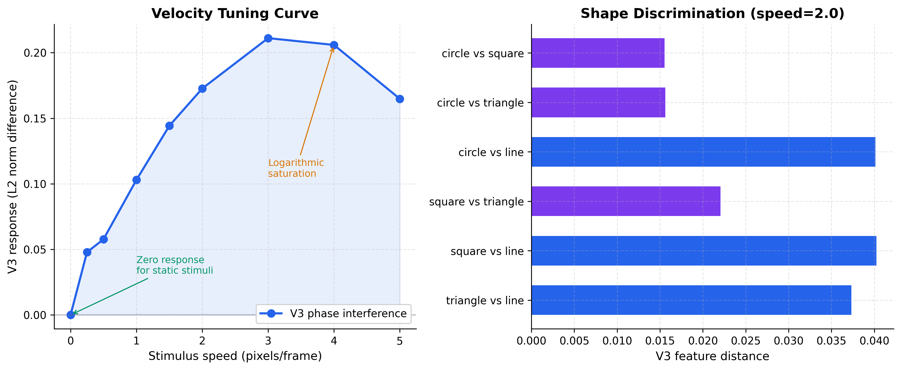
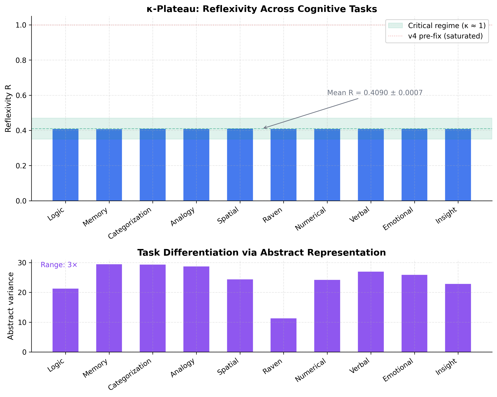
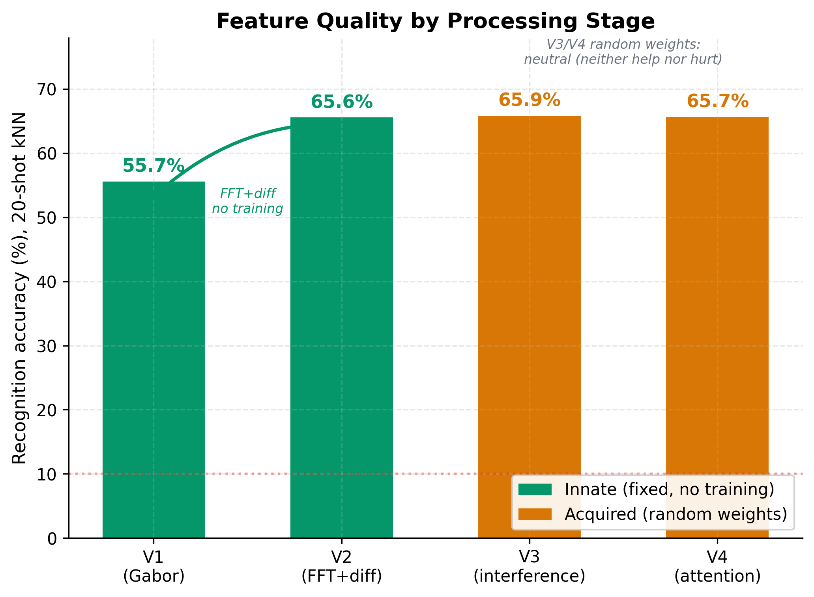
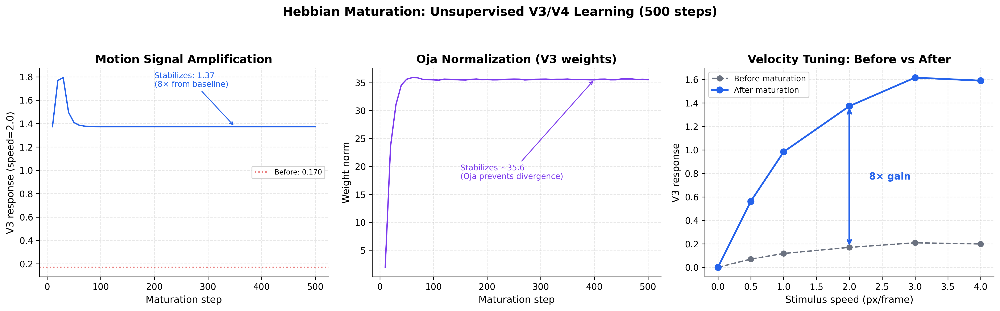

# SubstanceNet v4

[](LICENSE)
[](https://www.python.org/downloads/)
[](https://pytorch.org/)

**Experimental bio-inspired neural architecture for numerical verification of neuroscience hypotheses**

SubstanceNet is a computational platform that integrates empirically established results from visual neuroscience, memory systems, and neural oscillations into a single modular architecture. Each component corresponds to a biological structure; results can be compared with experimental data.

---

## Key Results (reproducible, seed=42)


*V3 phase interference produces velocity tuning matching primate MT/V3 electrophysiology — from wave mathematics alone.*


*Reflexivity R = 0.409 ± 0.001 across all 10 cognitive tasks — stable critical regime κ ≈ 1.*


*kNN recognition without backpropagation: 73.7% ± 2.0% (100-shot, 5 random inits). kNN dramatically outperforms prototypes at high N.*
```
MNIST backprop (1 epoch):     98.02%,  R = 0.41
Cognitive battery (10 tasks): 99.84%,  R = 0.409 ± 0.001
Recognition 100-shot kNN:     66.9% (seed=42), 73.7% ± 2.0% (5 trials)
V2 innate features:           65.6% without any training
Hebbian maturation:           8× motion signal, +5.2% recognition
```

All results reproducible: `python experiments/run_all_experiments.py`

---

## What This Project Verifies

### Empirically established facts

| Fact | Source | Module | Verified? |
|------|--------|--------|-----------|
| V1→V4 visual hierarchy | Hubel & Wiesel (1962); Nobel 1981 | BiologicalV1 → ObjectFeaturesV4 | ✅ |
| V1 Gabor-like receptive fields | Hubel & Wiesel (1962) | GaborFilterBank (fixed) | ✅ |
| V2 parallel streams (motion/texture/form) | Livingstone & Hubel (1987) | MosaicField18 thick/thin/pale | ✅ |
| Hebbian plasticity + Oja normalization | Hebb (1949); Oja (1982) | HebbianLinear | ✅ |
| Episodic memory consolidation | Tulving (1972); Wilson & McNaughton (1994) | Hippocampus | ✅ |
| Yerkes-Dodson optimal arousal | Yerkes & Dodson (1908) | R-targeting | ✅ |

### Hypotheses under verification

| Hypothesis | Source | Status |
|------------|--------|--------|
| Critical brain hypothesis | Beggs & Plenz (2003) | Partial: κ-plateau observed |
| Complementary Learning Systems | McClelland et al. (1995) | Partial: kNN > prototypes confirmed |
| Quantum-like cognition formalism | Busemeyer & Bruza (2012) | Partial: velocity tuning emerged |
| Emergence parameter κ ≈ 1 | Onasenko (2025) | Partial: stable R, needs ablation |

See [docs/SubstanceNet_v4_Project_Goal.md](docs/SubstanceNet_v4_Project_Goal.md) for full details.

---

## Architecture
```
Input [B, C, H, W]
  → RetinalLayer (RGB → rods + L/M/S cones)           Retina
  → BiologicalV1 (Gabor → Simple → Complex → Hyper)   V1
  → OrientationSelectivity (×8 orientations)
  → QuantumWaveFunction (ψ = A·e^(iφ))
  → NonLocalInteraction (attention)
  → MosaicField18 (thick/thin/pale stripes)            V2
  → DynamicFormV3 (phase interference + Hebbian)       V3
  → ObjectFeaturesV4 (multi-scale + Hebbian)           V4
  → coherence_fc → AbstractionLayer → Consciousness (ψ_C = F[P̂[ψ_C]])
                 → stability_fc → Classifier
  + Hippocampus (episodic memory, parallel)
  + TemporalController (κ ≈ 1 phase monitoring)
```

Three modes: `image` (static), `video` (temporal V3), `cognitive` (bypasses V1). Parameters: 1.36M.

See [docs/ARCHITECTURE.md](docs/ARCHITECTURE.md) for full module reference.

---

## Results

### Classification (backpropagation)

| Dataset | Accuracy | R | Script |
|---------|----------|---|--------|
| MNIST (1 epoch) | **98.02%** | 0.410 | `experiments/01_mnist_backprop.py` |
| Cognitive (10 tasks) | **99.84%** | 0.409 | `experiments/02_cognitive_battery.py` |

### Recognition (no backpropagation)

kNN top-5 weighted cosine voting on 128-dim amplitude+phase features:

| N-shot | kNN accuracy | Prototype accuracy | Method |
|--------|-------------|-------------------|--------|
| 5 | 40.0% | 41.9% | `experiments/03_recognition_paradigm.py` |
| 20 | 55.7% | 45.6% | |
| 100 | **66.9%** | 43.9% | |
| 100 (mean 5 trials) | **73.7% ± 2.0%** | — | |


*V2 (FFT+diff) provides +10% over V1 — innate features without training.*

### Dynamic perception


*Hebbian learning: 8× motion amplification, Oja normalization prevents divergence.*

| Maturation condition | 20-shot recognition | Delta |
|---------------------|-------------------|-------|
| Fresh (random weights) | 55.7% | baseline |
| Matured on primitives | 58.9% | +3.2% |
| Matured on MNIST | **60.8%** | **+5.2%** |

### Cross-modal (Moving MNIST)

| Condition | Accuracy | Script |
|-----------|----------|--------|
| Static→Static (28×28) | 57.2% | `experiments/08_moving_mnist.py` |
| Moving→Moving (64×64) | 52.6% | |
| Cross-modal | ~13% (feature space mismatch) | |

---

## Quick Start

### Install
```bash
git clone https://github.com/SubstanceNet/SubstanceNet_v4.git
cd SubstanceNet_v4
pip install -r requirements.txt
```

### Demo (30 seconds)
```bash
python demo/demo_quick.py          # Model health check
python demo/demo_velocity.py       # V3 velocity tuning with ASCII bars
python demo/demo_recognition.py    # See → remember → recognize
python demo/demo_consciousness.py  # κ-plateau across tasks
```

### Reproduce all results
```bash
python experiments/run_all_experiments.py
# → 6 JSON files in experiments/results/
# → 10 PNG figures in figures/
# → ~25 minutes on GPU
```

### Use as library
```python
import torch
from src.model.substance_net import SubstanceNet

model = SubstanceNet(num_classes=10, in_channels=1)
output = model(torch.randn(4, 1, 28, 28), mode='image')

# Consciousness metrics
metrics = model.get_consciousness_metrics(output)
print(f"R = {metrics['reflexivity_score']:.4f}")  # ~0.41

# Episodic memory
model.store_episode(output, task_type='digit', metrics={'acc': 0.95})
similar = model.recall(output, top_k=5)
model.consolidate_memory()
```

---

## Repository Structure
```
SubstanceNet_v4/
├── src/                            # Core architecture (4023 lines)
│   ├── cortex/                     # V1→V4 visual hierarchy + Hebbian
│   ├── wave/                       # ψ = A·e^(iφ) wave functions
│   ├── consciousness/              # Reflexive consciousness + controller
│   ├── hippocampus/                # Episodic memory (grid/place/time cells)
│   ├── model/                      # SubstanceNet assembler + layers
│   ├── data/                       # Dynamic primitives generator
│   ├── utils.py                    # Cognitive task generators
│   └── constants.py                # Parameters
│
├── experiments/                    # Reproducible experiments
│   ├── run_all_experiments.py      # Master script
│   ├── config.py                   # Seeds, paths, plot style
│   ├── 01_mnist_backprop.py        # MNIST classification
│   ├── 02_cognitive_battery.py     # 10-task κ-plateau
│   ├── 03_recognition_paradigm.py  # kNN recognition (no backprop)
│   ├── 04_velocity_tuning.py       # V3 velocity tuning curve
│   ├── 05_hebbian_maturation.py    # Unsupervised Hebbian learning
│   ├── 08_moving_mnist.py          # Moving digit recognition
│   ├── results/                    # JSON outputs
│   └── methodology/                # Experiment documentation
│
├── demo/                           # Quick demonstrations
│   ├── demo_quick.py               # 30-second health check
│   ├── demo_velocity.py            # V3 motion detection
│   ├── demo_recognition.py         # Recognition paradigm
│   └── demo_consciousness.py       # κ-plateau visualization
│
├── figures/                        # Publication-quality plots (PNG+PDF)
├── tests/                          # 38 tests (pytest)
├── docs/                           # Architecture, reports, methodology
├── research/                       # Historical experiment prototypes
└── archive/                        # Pre-fix baseline (February 2026)
```

---

## Testing
```bash
python -m pytest tests/ -v    # 38 tests, all passing
```

---

## References

1. Onasenko O. (2025) *Emergence Parameter κ ≈ 1.* [DOI: 10.5281/zenodo.17844282](https://doi.org/10.5281/zenodo.17844282)
2. Hubel D.H., Wiesel T.N. (1962) *J. Physiol.* 160:106-154.
3. McClelland J.L. et al. (1995) *Psychol. Rev.* 102:419-457.
4. Beggs J.M., Plenz D. (2003) *J. Neurosci.* 23:11167-11177.
5. Busemeyer J.R., Bruza P.D. (2012) *Quantum Models of Cognition.* Cambridge UP.
6. Hebb D.O. (1949) *The Organization of Behavior.* Wiley.
7. Bi G., Poo M. (2001) *Annu. Rev. Neurosci.* 24:139-166.

---

## Citation
```bibtex
@software{onasenko2026substancenet,
  author = {Onasenko, Oleksii},
  title = {SubstanceNet v4: Bio-inspired Neural Architecture for Numerical Verification of Neuroscience Hypotheses},
  year = {2026},
  publisher = {GitHub},
  url = {https://github.com/SubstanceNet/SubstanceNet_v4}
}
```

---

## License

Apache License 2.0 — see [LICENSE](LICENSE).

## Author

**Oleksii Onasenko** — [ORCID: 0009-0007-7017-8161](https://orcid.org/0009-0007-7017-8161) — olexxa62@gmail.com
