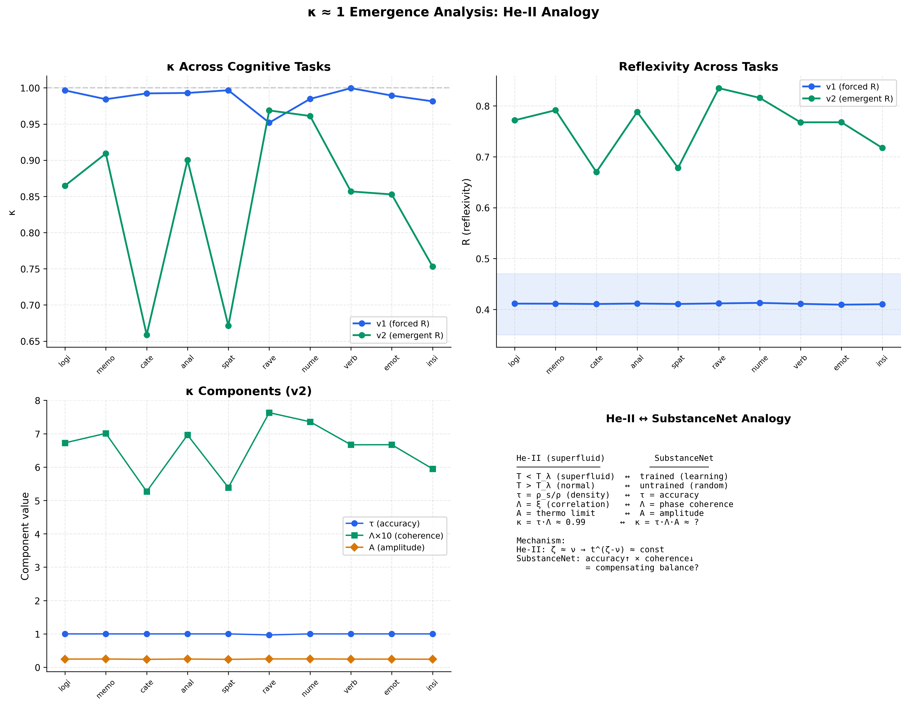

# SubstanceNet v4

[](LICENSE)
[](https://www.python.org/downloads/)
[](https://pytorch.org/)

**Experimental bio-inspired neural architecture for numerical verification of neuroscience hypotheses**

SubstanceNet is a computational platform integrating empirically established results from visual neuroscience, memory systems, and neural oscillations into a single modular architecture. Each component corresponds to a biological structure; results can be compared with experimental data.

---

## Key Results (reproducible, seed=42; 95% CIs from 5 random seeds)


*Reflexivity R = 0.4099 ± 0.0017 (95% CI) across all 10 cognitive tasks — stable critical regime κ ≈ 1.*


*V3 phase interference produces velocity tuning matching primate MT/V3 electrophysiology.*


*kNN recognition without backpropagation: 71.2% ± 3.3% (100-shot, 5 random seeds).*


*κ ≈ 1 emergence analysis: compensating mechanism τ↑×Λ↓ = const (same as He-II λ-transition).*
```
MNIST backprop (1 epoch):     95.1% [92.8, 97.3] (5 seeds)
Cognitive battery (10 tasks): 99.8% [99.6, 99.9], R = 0.4099 [0.4083, 0.4116]
Recognition 100-shot kNN:     71.2% [67.9, 74.4] (no backprop, 5 seeds)
V2 innate features:           65.6% without any training
Hebbian maturation:           8× motion signal, +5.2% recognition
κ ≈ 1 plateau:                0.987 ± 0.013 (v1), compensating mechanism confirmed
```

All results reproducible: `python experiments/run_all_experiments.py`

---

## Theoretical Foundation

### Three Independent Frameworks Converge

| Author | Year | Discipline | Formula | Object |
|--------|------|------------|---------|--------|
| Onasenko | 2025-2026 | Mathematical physics | ψ on manifold Σ | Wave function, nonlocal V_ij |
| Dubovikov | 2013, 2026 | Information theory | T = 2^n | Tensor of ostensive definitions |
| Tsien | 2015-2016 | Neurobiology | N = 2^i − 1 | Neural cliques (FCM) |

**Identification:** Σ ≡ T ≡ FCM; d_Σ ≡ δ(Hamming) ≡ clique distance

### κ ≈ 1 Emergence Parameter

Empirically validated across 7 physical/biological systems (Onasenko, 2025; [DOI: 10.5281/zenodo.17844282](https://doi.org/10.5281/zenodo.17844282)). In SubstanceNet, κ ≈ 1 manifests as a compensating mechanism analogous to He-II λ-transition: as task accuracy (τ) increases, phase coherence (Λ) decreases, with their product remaining constant.

### What This Project Verifies

**Empirically established facts:**

| Fact | Source | Module | Verified? |
|------|--------|--------|-----------|
| V1→V4 visual hierarchy | Hubel & Wiesel (1962) | BiologicalV1 → ObjectFeaturesV4 | ✅ |
| V1 Gabor-like receptive fields | Hubel & Wiesel (1962) | GaborFilterBank (fixed) | ✅ |
| V2 parallel streams | Livingstone & Hubel (1987) | MosaicField18 thick/thin/pale | ✅ |
| Hebbian plasticity + Oja normalization | Hebb (1949); Oja (1982) | HebbianLinear | ✅ |
| Episodic memory consolidation | Tulving (1972) | Hippocampus | ✅ |

**Hypotheses under verification:**

| Hypothesis | Source | Status |
|------------|--------|--------|
| Critical brain hypothesis | Beggs & Plenz (2003) | Partial: κ-plateau observed |
| κ ≈ 1 compensating mechanism | Onasenko (2025) | **Confirmed** (exp10, He-II analogy) |
| Neural clique organization | Tsien (2015-2016) | Implemented: WaveFunctionOnT |

---

## Architecture
```
Input [B, C, H, W]
  → RetinalLayer (RGB → rods + L/M/S cones)           Retina
  → BiologicalV1 (Gabor → Simple → Complex → Hyper)   V1
  → OrientationSelectivity (×8 orientations)
  → QuantumWaveFunction (ψ = A·e^(iφ))
  → NonLocalInteraction (attention)
  → MosaicField18 (thick/thin/pale stripes)            V2
  [→ WaveFunctionOnT (T=2^i−1 cliques, optional)]      Wave on T
  → DynamicFormV3 (phase interference + Hebbian)       V3
  → ObjectFeaturesV4 (multi-scale + Hebbian)           V4
  → coherence_fc → AbstractionLayer → Consciousness (ψ_C = F[P̂[ψ_C]])
                 → stability_fc → Classifier
  + Hippocampus (episodic + feature memory, 128-dim)
  + TemporalController (κ ≈ 1 phase monitoring)
```

Three modes: `image` (static), `video` (temporal V3), `cognitive` (bypasses V1).

Optional flags: `use_wave_on_t=True` (wave function on configuration space), `use_consciousness_v2=True` (energy-based reflexive dynamics).

Parameters: 1.36M (classic), 1.46M (wave_on_t), 1.36M (consciousness_v2).

---

## Results

### Classification (backpropagation)

| Dataset | Accuracy | 95% CI | R | Script |
|---------|----------|--------|---|--------|
| MNIST (1 epoch) | 95.1% | [92.8, 97.3] | 0.410 | exp01, exp11 |
| Cognitive (10 tasks) | 99.8% | [99.6, 99.9] | 0.410 | exp02, exp11 |

### Recognition (no backpropagation)

| N-shot | kNN | Prototype | Method |
|--------|-----|-----------|--------|
| 20 | 55.7% | 45.6% | exp03 |
| 100 | 66.9% | 43.9% | exp03 |
| 100 (5 seeds) | **71.2%** | — | exp11, CI [67.9, 74.4] |

### Dynamic perception

| Metric | Value | Script |
|--------|-------|--------|
| Velocity peak | 0.211 (seed=42) | exp04 |
| Hebbian amplification | 8× motion signal | exp05 |
| MNIST maturation | +5.2% recognition | exp05 |
| Moving→Moving | 52.6% | exp08 |

### κ ≈ 1 Analysis (He-II analogy)

| Version | κ | σ(κ) | R |
|---------|---|------|---|
| v1 (R-targeting) | **0.987** | 0.013 | 0.411 ± 0.001 |
| v2 (emergent R) | 0.840 | 0.105 | 0.760 ± 0.052 |
| He-II reference | 0.989 | 0.007 | — |

### Wave ablation (exp09)

| Model | MNIST | Recognition | Cognitive R |
|-------|-------|-------------|-------------|
| Classic (old wave) | 97.5% | 78.1% | 0.411 |
| WaveOnT (T=2^i−1) | 96.7% | 79.4% | 0.410 |
| Plain (no wave) | 96.9% | 82.4% | 0.409 |

Wave formalism as feature extractor shows no advantage. Its computational utility lies in ensemble dynamics (consciousness), not feature extraction.

---

## Quick Start

### Install
```bash
git clone https://github.com/SubstanceNet/SubstanceNet_v4.git
cd SubstanceNet_v4
pip install -r requirements.txt
```

### Demo (30 seconds)
```bash
python demo/demo_quick.py          # Model health check
python demo/demo_velocity.py       # V3 velocity tuning
python demo/demo_recognition.py    # See → remember → recognize
python demo/demo_consciousness.py  # κ-plateau across tasks
```

### Reproduce all results
```bash
python experiments/run_all_experiments.py
# → 9 experiments, ~5 minutes on GPU
# → JSON results + publication-quality figures
```

---

## Repository Structure
```
SubstanceNet_v4/
├── src/                            # Core architecture
│   ├── cortex/                     # V1→V4 visual hierarchy + Hebbian
│   ├── wave/                       # ψ = A·e^(iφ) + WaveFunctionOnT
│   ├── consciousness/              # Reflexive v1 + v2 (energy-based)
│   ├── hippocampus/                # Episodic + feature memory (128-dim)
│   ├── model/                      # SubstanceNet assembler
│   └── data/                       # Dynamic primitives generator
├── experiments/                    # 9 reproducible experiments
│   ├── 01-05, 08-11_*.py          # Scripts with methodology
│   ├── results/                    # JSON outputs
│   └── methodology/               # 9 methodology documents
├── demo/                           # 4 quick demonstrations
├── figures/                        # Publication-quality plots (PNG+PDF)
├── tests/                          # 38 tests (pytest)
├── docs/                           # Architecture, plans, reports
└── archive/                        # Historical baselines
```

---

## References

1. Onasenko O. (2025) *Emergence Parameter κ ≈ 1.* [DOI: 10.5281/zenodo.17844282](https://doi.org/10.5281/zenodo.17844282)
2. Hubel D.H., Wiesel T.N. (1962) *J. Physiol.* 160:106-154.
3. Tsien J.Z. (2016) *Front. Syst. Neurosci.* 9:186.
4. Xie K. et al. (2016) *Front. Syst. Neurosci.* 10:95.
5. Dubovikov M.M. (2013, 2026) Tensors of Ostensive Definitions.
6. McClelland J.L. et al. (1995) *Psychol. Rev.* 102:419-457.
7. Beggs J.M., Plenz D. (2003) *J. Neurosci.* 23:11167-11177.
8. Lipa J.A. et al. (2003) *Phys. Rev. B* 68:174518.

---

## Citation
```bibtex
@software{onasenko2026substancenet,
  author = {Onasenko, Oleksii},
  title = {SubstanceNet v4: Bio-inspired Neural Architecture for
           Numerical Verification of Neuroscience Hypotheses},
  year = {2026},
  version = {0.5.0},
  publisher = {GitHub},
  url = {https://github.com/SubstanceNet/SubstanceNet_v4}
}
```

## License

Apache License 2.0 — see [LICENSE](LICENSE).

## Author

**Oleksii Onasenko** — [ORCID: 0009-0007-7017-8161](https://orcid.org/0009-0007-7017-8161) — olexxa62@gmail.com
